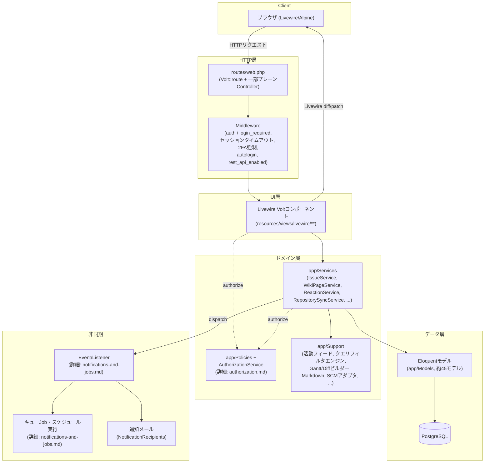
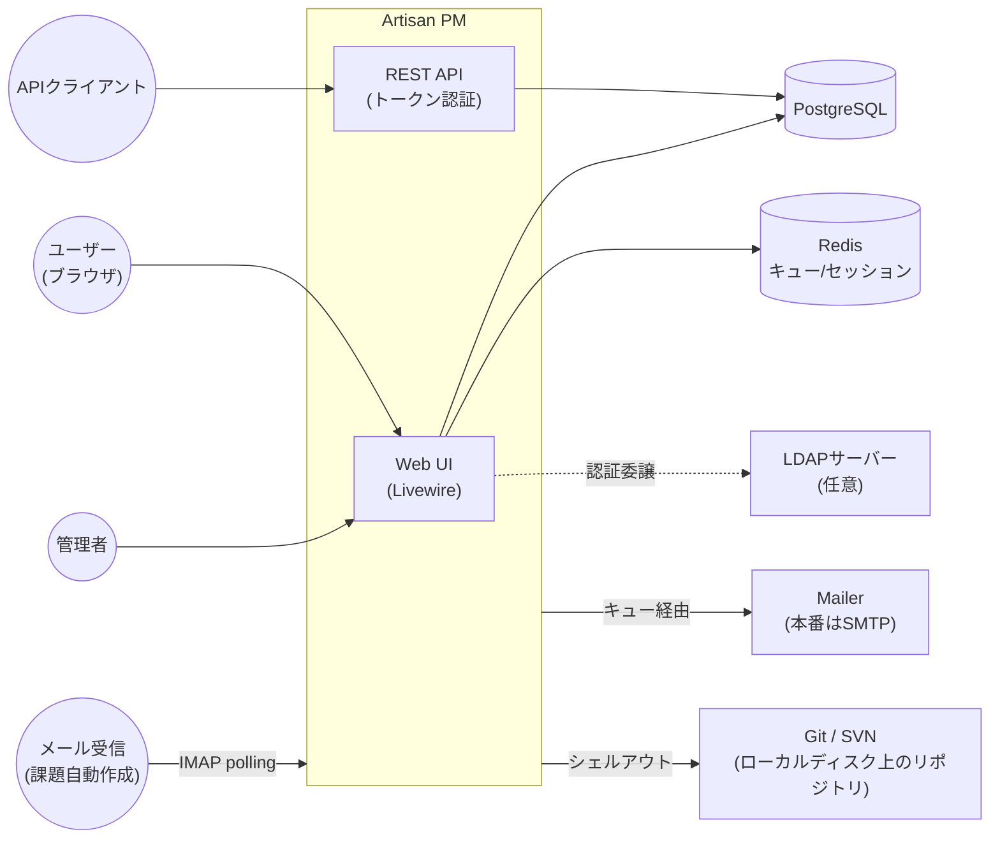

# 設計資料

Artisan PMの内部設計を俯瞰するための資料群です。「何がどう実装されているか」を素早く把握したいときの入口として使ってください。個々の機能がRedmine本家とどこまで一致しているか(意図的な逸脱を含む)は、ここではなく[`../parity-checklist.md`](../parity-checklist.md)が正です — この資料群はあくまで「今のコードがどう組み立てられているか」の説明であり、Redmineとの差分表ではありません。

## 資料一覧

| 資料 | 扱う範囲 |
|---|---|
| [`domain-model.md`](domain-model.md) | ドメインモデル全体のER図。プロジェクト構造・課題管理・Wiki・フォーラム/News・工数・SCM・カスタムフィールドの7領域に分けて掲載 |
| [`authorization.md`](authorization.md) | 権限モデル。ロール解決の3階層(ゲスト/非メンバー/メンバー)、`AuthorizationService`の判定フロー、Policyとの関係 |
| [`request-lifecycle.md`](request-lifecycle.md) | HTTPリクエストがLivewire Volt画面まで届く経路と、代表的な書き込み処理(課題作成、Wiki編集)のシーケンス |
| [`issue-workflow.md`](issue-workflow.md) | 課題のステータス遷移(ワークフロー)、親子集計ロールアップ、`precedes`/`follows`関連からの自動リスケジュール |
| [`notifications-and-jobs.md`](notifications-and-jobs.md) | Event/Listenerによる通知パイプライン(メール・Webhook)と、スケジュール実行されるバックグラウンドジョブ一覧 |

## 全体構成(レイヤー)

この図で押さえておきたい点:

- **Voltコンポーネントが実質的にコントローラ**。`routes/web.php`の大半は`Volt::route()`で、単一ファイルコンポーネント(PHPロジック+Bladeテンプレート)がそのままHTTPハンドラになる。プレーンな`Controller`はPDF/Atom/添付ファイルなど「Livewireの往復に向かないレスポンス」を返す箇所のみ(`app/Http/Controllers/`)。CSVエクスポートはこの例外に含まれず、Voltコンポーネントのアクション自身が`response()->streamDownload()`を直接返す(詳細は`request-lifecycle.md`)。
- **認可はPolicy経由で必ず`AuthorizationService`に集約**。Voltコンポーネントが直接ロール判定をすることはない(詳細は`authorization.md`)。
- **書き込みはServiceを経由**。Volt側は入力検証とUI状態管理のみを持ち、実際のモデル操作・付随処理(ロールアップ再計算、Journal記録、イベント発火)は`app/Services`が担う。
- **通知は非同期**。Serviceがドメインイベント(`IssueCreated`等)を発火し、Listenerがメール送信・Webhook配信を行う——同期処理のパスには通知ロジックが漏れ出さない。

## システムコンテキスト

Redmineとの対応で意識しておくべき外部依存の違い:

- Redmineの「プラグインによるSCMアダプタ追加」に相当する仕組みは`config/scm.php`+`App\Support\Scm\ScmAdapter`実装クラスの追加のみで、プラグイン読み込み機構自体は`app/Support/Plugins/PluginManager`が別途担う(実行時プラグイン検出は意図的に未実装 — 詳細はチェックリスト参照)。
- メール受信(課題の自動作成)はIMAPポーリングの`ProcessIncomingMailJob`(5分間隔)で、Redmine本家の`rake redmine:email:receive_imap`相当。
