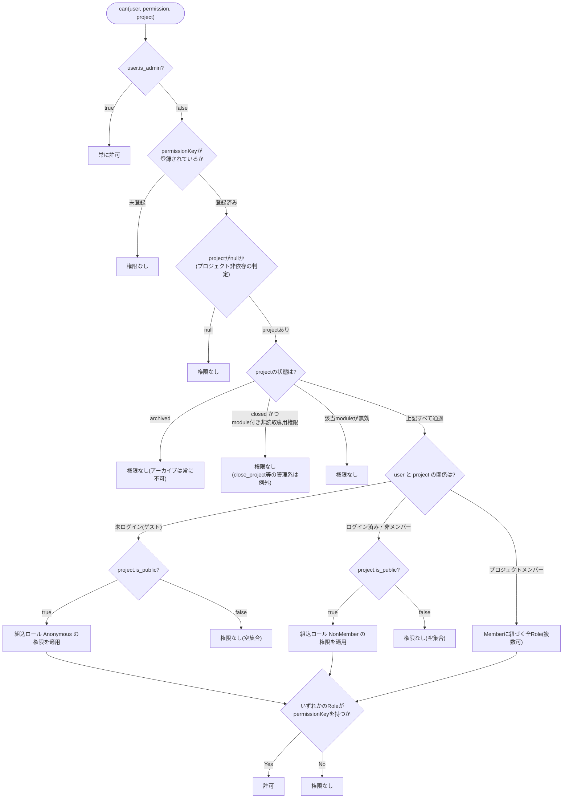
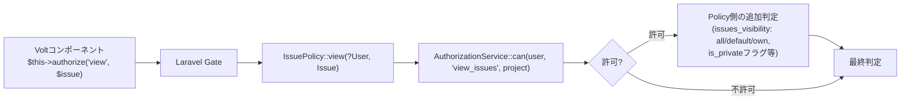
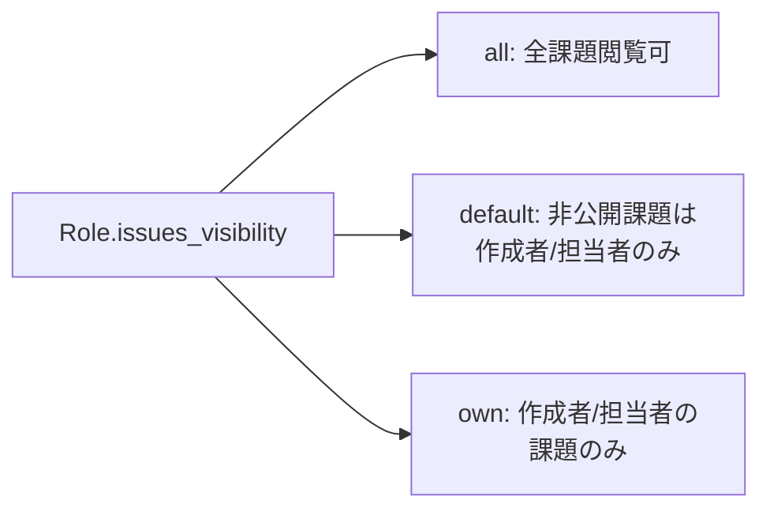

# 権限モデル

Redmineの「プロジェクトごと・ロールごとの権限」モデルを`App\Support\Authorization\AuthorizationService`に集約している。Policyクラス(`app/Policies/`)はこのサービスに判定を委譲するだけで、ロール解決ロジックを自前で持たない。

## ロール解決の3階層

- 「複数ロールを持つ場合は最も緩い判定が優先」というのは、`Check`が**いずれかのRoleが権限を持てば許可**というOR判定であることを指す(`issues_visibility`のような「段階」を持つ設定も同様に最も緩い側が勝つ)。
- `project.isArchived()`/`isClosed()`/モジュール有効判定は、ロール解決(誰がどのロールを持つか)より**先**に評価される(`AuthorizationService::can()`内の判定順) — アーカイブ済み・クローズ済みプロジェクトでは、ロールを何も持っていなくても同じ「権限なし」に落ちるため実害は無いが、判定の順序としては先。
- ゲスト・非メンバーへの組込ロール適用は、実際に`Role`テーブルへ`builtin = 'anonymous' / 'non_member'`の行がシードされていて初めて機能する——行が無ければ空集合(権限なし)として扱われる。

## Policyとの関係

- Policyの`view`系メソッドはすべて`?User $user`(nullable)を受け取る——ゲストがpublicプロジェクトの課題/Wiki/Newsを閲覧できる(`login_required`設定がoffの場合)経路を、モデル層の型で強制している。
- `AuthorizationService::can()`一つで足りない判定(例: 課題の`is_private`フラグ、非公開Journal、`issues_visibility`によるown/defaultの絞り込み)はPolicy側に残る——「誰でもいい権限チェック」と「このモデルインスタンス固有の追加条件」を分離する設計。

## 権限キーとモジュールの対応

`App\Support\Permissions\PermissionRegistry`が起動時に全権限キーを登録する(`PermissionServiceProvider`)。各権限は以下を持つ:

| 属性 | 意味 |
|---|---|
| `module` | 対応する`ProjectModuleKey`(例: `view_issues`→issue_tracking)。`null`なら「プロジェクト管理」系でモジュール判定をスキップ(`close_project`等) |
| `requirement` | `PermissionRequirement::Member`(メンバー専用)等——組込ロールに付与できるかどうかの制約 |
| `readOnly` | closedプロジェクトでも許可され続けるか(閲覧系はtrue) |

Redmineの`Redmine::AccessControl.map`(プラグインが権限を追加登録できる仕組み)に相当するが、本アプリは起動時の固定登録のみで、プラグインからの実行時追加は未対応(意図的、詳細はチェックリスト参照)。

## 可視性スコープの3段階(課題)

複数ロールを持つ場合は最も緩い(`all` > `default` > `own`)ものが適用される。同じ「最も緩いものが勝つ」考え方は`Role.users_visibility`(ユーザー閲覧範囲、`all`/`members_of_visible_projects`の2段階)にも適用されている。
