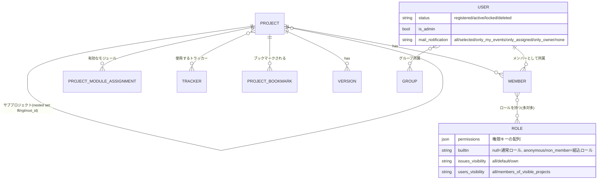
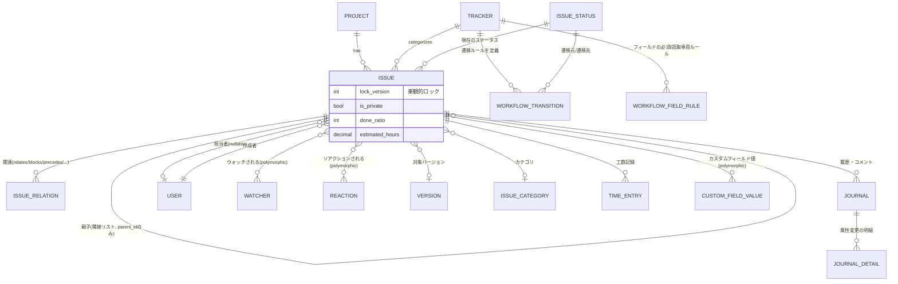
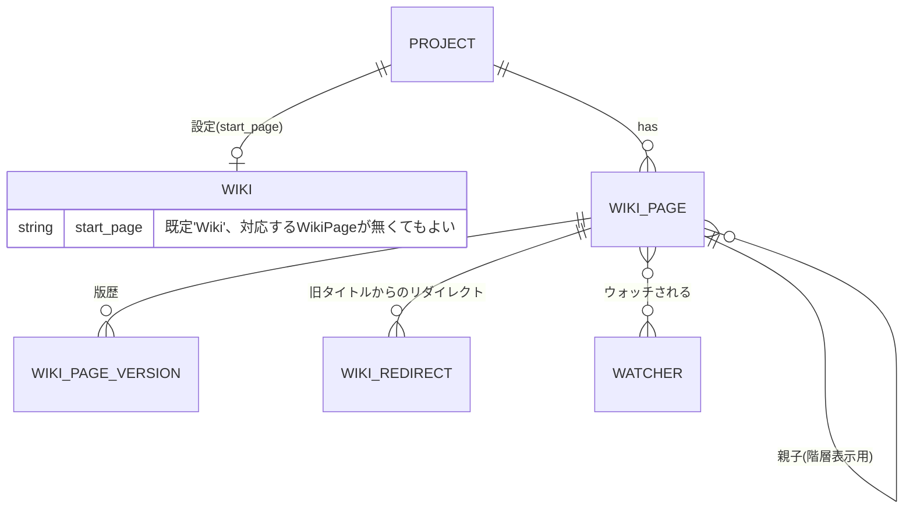
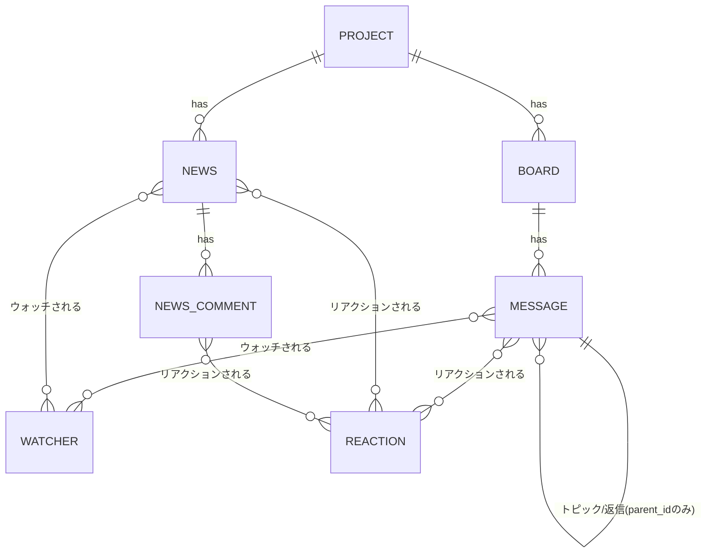
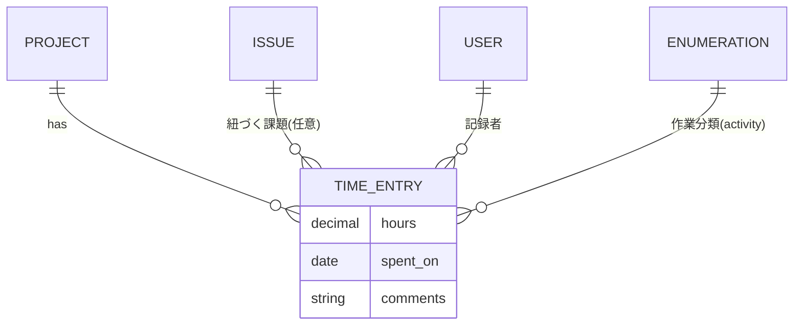
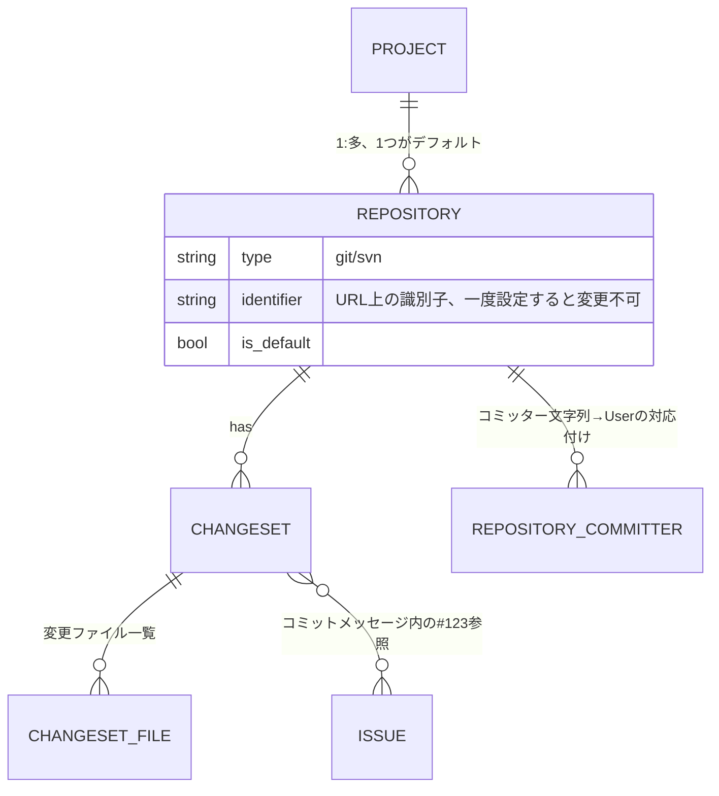
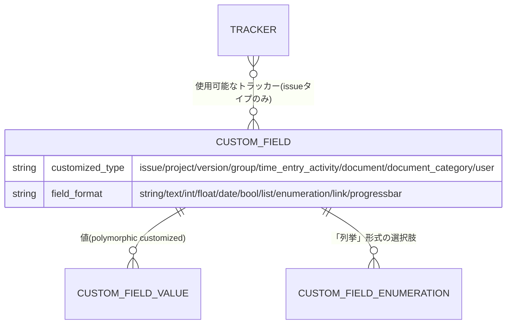

# ドメインモデル

`app/Models/`配下の約45モデルを、機能領域ごとに分けて掲載します。1枚のER図に全モデルを詰め込むと可読性が失われるため、領域をまたぐ関連は各図に重複して登場させています(例: `PROJECT`は全図に登場する)。

## 1. プロジェクト構造・権限

- `Member`⇔`Role`は多対多(`member_roles`ピボット)。ユーザーが複数ロールを持つ場合、権限は**最も緩い側が優先**(`AuthorizationService`が全ロールの`OR`を取る)。
- ゲスト(未ログイン)と非メンバー(ログイン済みだが当該プロジェクトのメンバーでない)には、`Role.builtin`が`anonymous`/`non_member`の組込ロールが適用される — 詳細は[`authorization.md`](authorization.md)。
- `Project`の階層は`kalnoy/nestedset`によるネステッドセット(`lft`/`rgt`/`root_id`)。**`Issue`の親子は同じネステッドセットではなく単純な隣接リスト**(`parent_id`のみ)——意図的な設計逸脱(詳細は`../parity-checklist.md`)。

## 2. 課題管理

- ステータス遷移は`WorkflowTransition`(トラッカー×ロール×現在ステータス→遷移可能な次ステータス、作成者/担当者向けの追加ルールを含む)で判定 — 詳細は[`issue-workflow.md`](issue-workflow.md)。
- `Journal`はコメント本体と属性変更ログの両方を1テーブルで表現(`notes`があればコメント、`JournalDetail`があれば属性変更 — 両方持つことも、どちらも空(=非表示)もあり得る)。
- `Watcher`/`Reaction`はどちらも`watchable_type`/`reactable_type`によるポリモーフィック関連で、`Issue`以外に`WikiPage`/`News`/`Message`/`NewsComment`/`Journal`(Reactionのみ)にも同じ形で付く。

## 3. Wiki

- `Wiki`は「そのプロジェクトのWiki設定」を表す1行(プロジェクトごとに遅延作成、`Project::wikiOrCreate()`)。`start_page`は文字列のみで、対応する`WikiPage`が存在しなくてもよい(存在しなければ新規作成フォームへ誘導)。
- `WikiRedirect`はページ名変更時に旧タイトルでのアクセスを新タイトルへ転送する。

## 4. フォーラム・News

- `Message`はトピックと返信を同一テーブル・同一モデルで表現(`parent_id`が`null`ならトピック)。
- Wiki/課題本文と異なり、News本文・フォーラム投稿には`@mention`機能が無い(Redmine本家にも存在しないため — 詳細は`../parity-checklist.md`の該当行)。

## 5. 工数管理

- `Enumeration`はRedmineの「一般設定の列挙値」テーブル相当で、`EnumerationType`(優先度/作業分類/文書カテゴリ)によって同一テーブルを使い回す。

## 6. SCM(ソースコード管理)

- 実際のリポジトリ操作(`log`/`diff`/`blame`/`cat`)は`App\Support\Scm\ScmAdapter`実装クラスが`git`/`svn`バイナリをシェルアウトして行う——このER図が表すのはメタデータのみで、ファイル内容そのものはDBに持たない。

## 7. カスタムフィールド

- `customized_type`はRedmineの`CustomField`サブクラス設計(`IssueCustomField`等の継承)の代わりに、単一テーブル+区分カラムで表現している。
- `field_format = 'list'`(単純な文字列配列の選択肢)と`'enumeration'`(`CustomFieldEnumeration`という別テーブルを持つ、位置/有効フラグ付きの選択肢)は別物——調査の結果判明した区別で、チェックリストにも詳細記録あり。
