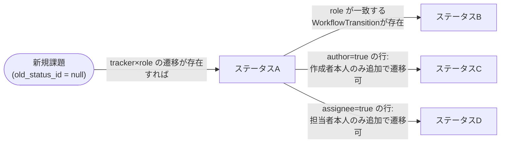
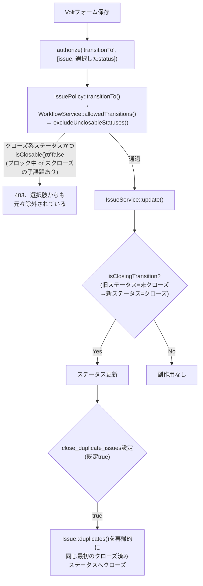
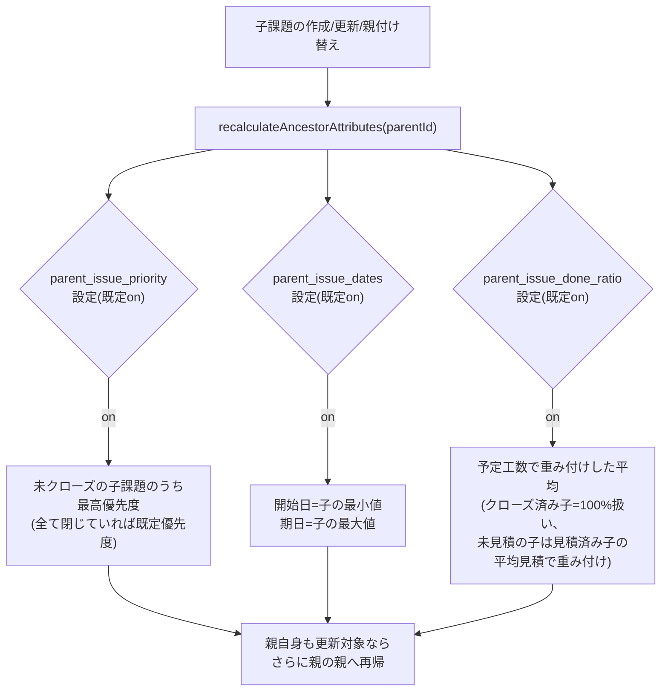
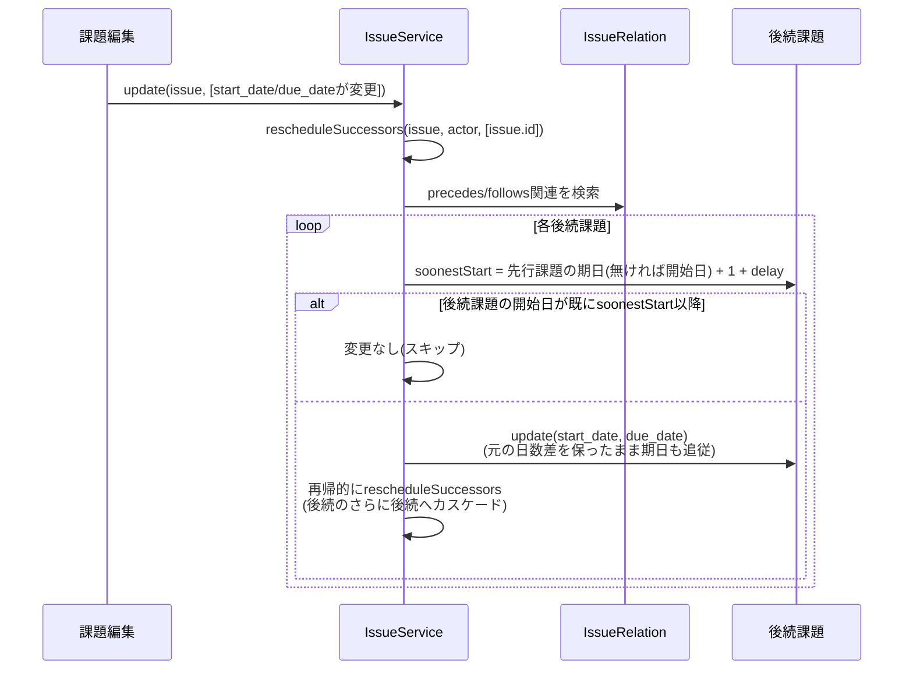

# 課題のライフサイクル

## ステータス遷移(ワークフロー)

`WorkflowTransition`は`(tracker_id, role_id, old_status_id, new_status_id, author, assignee)`の組で「誰が・どのステータスから・どのステータスへ遷移できるか」を表す。`old_status_id`が`null`のとき「新規課題作成時の初期ステータス」を意味する。

- 実際に遷移可能かどうかの判定は「その課題のトラッカー」×「操作者が持つロール(複数可、いずれか一つで可)」×「現在のステータス」の組み合わせで`WorkflowTransition`を検索し、`author`/`assignee`列がtrueの行は操作者がその課題の作成者/担当者本人である場合のみ追加で有効になる。
- **新規課題作成時の初期ステータス決定は、このワークフローテーブルを一切参照しない**(`IssueService::create()`は`IssueStatus`の既定値をそのまま使う)——`old_status_id = null`の行を編集画面で編集しても挙動には反映されない、という既知の制限がチェックリストに明記されている。
- `WorkflowFieldRule`(同じ4次元キー+`field_name`)は「そのステータスでそのフィールドが必須/読取専用/非表示か」を制御する、遷移とは独立したテーブル。

## クローズ時の副作用

- クローズ可否は`isClosable()`(「ブロック中の課題(`blocks`関連で未クローズの相手がいる)」と「未クローズの子課題を持つ」の2条件、Redmineの`Issue#closable?`相当)で判定するが、この判定は`WorkflowService::excludeUnclosableStatuses()`が選択肢一覧からクローズ不可なステータスを事前に除外する形で行われ、フォーム送信時にも`IssuePolicy::transitionTo()`が同じ判定を再実行する——選択肢を隠すだけのUI側の制御ではなく、サーバー側でも再検証される。
- 重複クローズの再帰処理は、相互複製(AがBの複製、BもAの複製)による無限ループを、都度DBから再取得して「既にクローズ済みか」を確認することで安全に停止させている。

## 親への集計ロールアップ

子課題の作成・更新(親の付け替えを含む)のたびに、親(および祖先すべて)を再計算する。

- 各設定がoffの場合、対応する項目は子から算出せず「誰でも自由編集可」のまま(Redmineの「導出値のためロック」という挙動を模したUI無効化は、on設定の項目にのみ適用される)。

## `precedes`/`follows`からの自動リスケジュール

- 循環関連による無限再帰を防ぐため、カスケード中に一度リスケジュール済みの課題IDを再訪しない訪問済みセット+最大50ホップの上限を持つ(`IssueRelation::wouldCreateCycle()`による新規作成時の事前検証とは別に、既存データに対する安全策として維持)。
- **意図的な簡略化2点**(いずれもコード上に明記): (1) 稼働日カレンダーが本アプリに存在しないため暦日ベースで計算(Redmine本家は稼働日ベース)。(2) 後続課題が子を持つ場合もRedmineのように子課題側へ伝播させず、後続課題自身の日付を直接変更する(親の日付ロック機構は元々start_date/due_dateには適用されないため、既存の「日付は誰でも自由編集可」という挙動と一致させた)。
