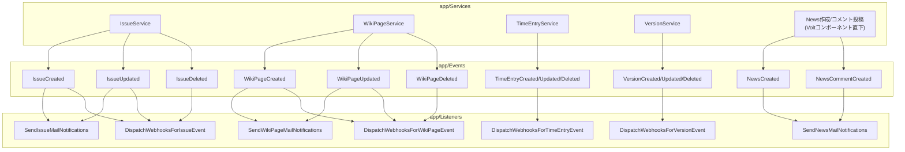
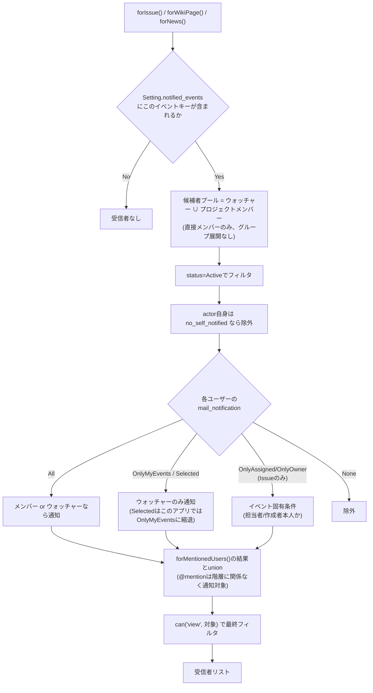
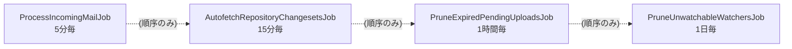

# 通知パイプラインとバックグラウンドジョブ

## イベント駆動の通知・Webhook

- News・工数記録・バージョンはいずれもメールとWebhookの片方だけ持つ: Newsはメール通知のみでWebhookが無く、工数記録とバージョンは逆にWebhookのみでメール通知が無い。表を参照:

| イベント | メール通知 | Webhook |
|---|---|---|
| 課題 作成/更新 | ✅ (`@mention`込み) | ✅ |
| 課題 削除 | — | ✅ |
| Wiki 作成/更新 | ✅ (`@mention`込み) | ✅ |
| Wiki 削除 | — | ✅ |
| News 作成/コメント | ✅ | — |
| 工数記録 作成/更新/削除 | — | ✅ |
| バージョン 作成/更新/削除 | — | ✅ |

## 受信者解決(`NotificationRecipients`)

Issue/Wiki/News、いずれも「候補者プールを合成 → ティア別フィルタ → 可視性フィルタ」という同じ形で受信者を決める。

- `@mention`された対象ユーザーは、上記のウォッチャー/メンバーのティア判定を一切経由せず(`forMentionedUsers()`)、最後の可視性フィルタだけを通る——Redmine本家の`notified_mentions`が`notified_users`/`notified_watchers`と対等にunionされる設計と一致。
- Newsだけ判定が異なり、`None`以外の**すべてのティア**が「メンバーまたはウォッチャーなら通知」という単純な条件になる(Redmineの`User#notify_about?(News)`に合わせた設計、`resolve()`の`$allTiersRequireMembershipOrWatch`フラグで表現)。

## スケジュール実行されるバックグラウンドジョブ

`routes/console.php`で`Schedule::job(...)`により登録されている(Redmineのcron/rakeタスクに相当)。以下は互いに独立した4つのジョブを実行間隔が短い順に並べただけで、矢印は依存関係やトリガーを意味しない:

| ジョブ | 頻度 | 役割 | Redmine本家との対応 |
|---|---|---|---|
| `ProcessIncomingMailJob` | 5分毎 | IMAPをポーリングし、受信メールから課題を自動作成 | `rake redmine:email:receive_imap` |
| `AutofetchRepositoryChangesetsJob` | 15分毎 | `autofetch_changesets`設定が有効な全リポジトリへ同期をディスパッチ | 自動フェッチ設定 |
| `PruneExpiredPendingUploadsJob` | 1時間毎 | 未紐付けのまま期限切れになった一時アップロード(添付ファイル)を削除 | Redmineには対応する仕組みなし(本アプリ独自のAPI経由アップロード用GC) |
| `PruneUnwatchableWatchersJob` | 1日毎 | 閲覧権限を失った(メンバーシップ剥奪・プロジェクトアーカイブ等)ウォッチを解除 | `Watcher.prune` / `rake redmine:watchers:prune`(本家は手動/cron実行が前提、本アプリは自動スケジュールへ変更——意図的な逸脱) |

このほか、`RepositorySyncJob`(実際のgit/svn同期処理本体、`AutofetchRepositoryChangesetsJob`からディスパッチされる)・`ImportIssuesJob`/`ImportTimeEntriesJob`(CSVインポート)は、スケジュール実行ではなくトリガー起点(手動同期ボタン、インポートフォーム送信)でキューに積まれる。
