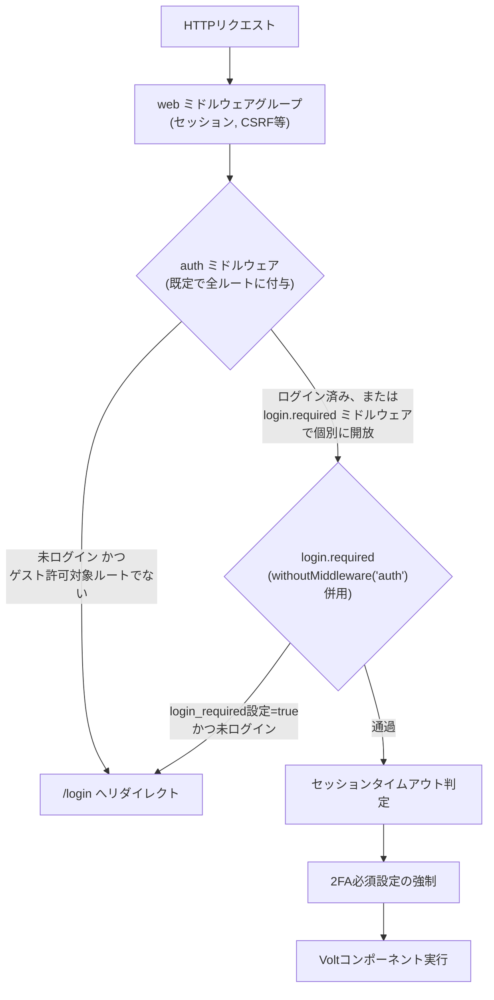
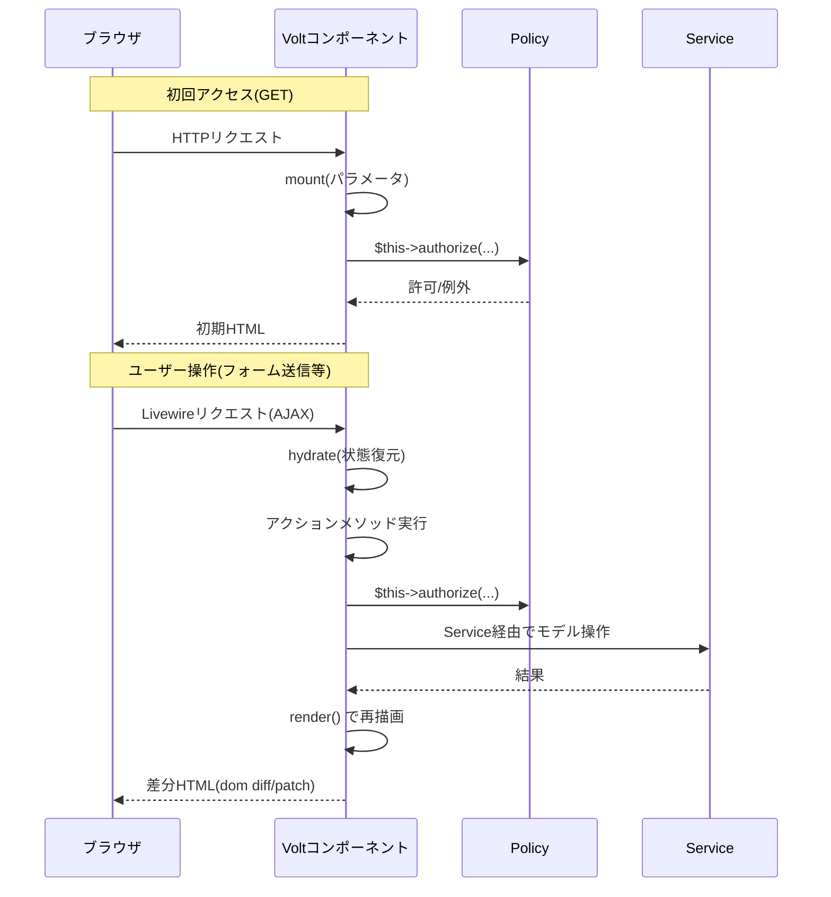
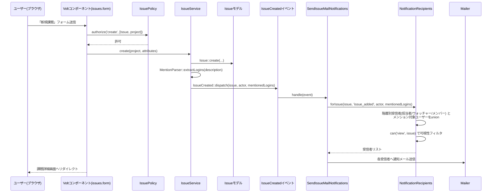
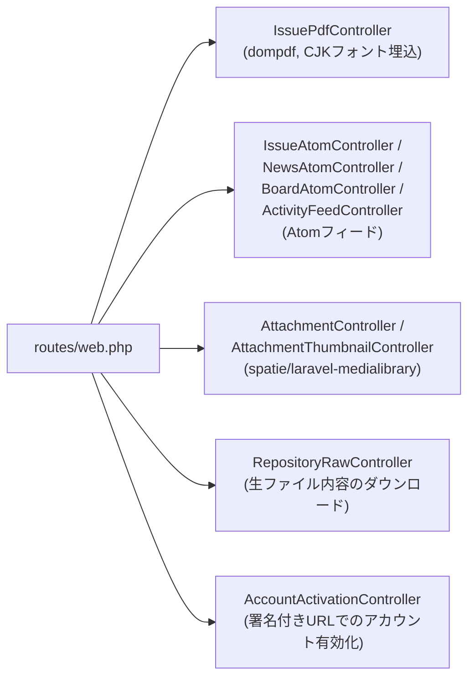

# リクエストライフサイクル

## ルーティングとミドルウェア

- 既定では**全ルートが`auth`ミドルウェア配下**(ログイン必須)。ゲスト到達を許すルート(`issues.index`/`issues.show`/`wiki.*`等)だけが個別に`->withoutMiddleware('auth')->middleware('login.required')`を付与される——別グループに切り出す設計は採らなかった(`issues/create`のようなリテラルセグメントと`issues/{issue}`のようなワイルドカードの登録順が壊れるため)。
- `login.required`ミドルウェア(`EnforceLoginRequiredSetting`)は「`login_required`設定がtrue(既定)なら未ログインを`AuthenticationException`で弾く」というゲートで、実際に「このプロジェクトが公開かどうか」の判定はここでは行わない——それは各Voltコンポーネントの`mount()`が呼ぶPolicyの役目(詳細は[`authorization.md`](authorization.md))。

## Voltコンポーネントのライフサイクル

- `mount()`はGET相当の初回リクエストでのみ実行される。以降のアクション呼び出し(`wire:click`等)は`hydrate → アクション → render`のサイクルを繰り返す——`mount()`内で読み込んだEloquentリレーションは、Livewireがモデルのシリアライズ時に保持する場合としない場合があるため、「アクション内で新たにモデルを取得し直しても、実際には毎リクエストrehydrateされるので実害が薄い」という前提に基づいた実装が随所にある(例: リアクション機能の実装時に検証済み——詳細はチェックリストのリアクション行)。
- `mount()`からの`$this->redirect(..., navigate: true)`は、初回ロード時点でも(アクションからでなくても)呼び出せる——`wiki.index`ルートが「Wikiの開始ページへリダイレクトする」という役割に変わった際、この性質を利用してURLもルート名も変えずに挙動だけを差し替えた(詳細は`../../README.md`の「Notable design decisions」)。

## 例: @mention付き課題作成のフルパス

通知パイプラインの詳細(イベント一覧・受信者解決ロジック)は[`notifications-and-jobs.md`](notifications-and-jobs.md)を参照。

## 例: PDF/Atomなど「Livewireで完結しないレスポンス」

`app/Http/Controllers/`配下のプレーンControllerは、Volt(HTML部分更新が前提)では扱いにくいレスポンス種別のみを担当する:

これらは`Volt::route()`ではなく通常の`Route::get(...)->name(...)`で登録され、認可チェックは各Controllerのアクション内で明示的に行う(Voltの`mount()`に相当する箇所がないため)。

**CSVエクスポートはこのパターンに含まれない**——課題一覧・工数一覧のCSVエクスポートは、専用Controllerを介さずVoltコンポーネント自身のアクションが`response()->streamDownload()`を直接返す(`issues.index`等)。認可・データ取得ロジックを画面表示と同じコンポーネント内で完結させたいという理由で、この1点だけはプレーンController化していない。
